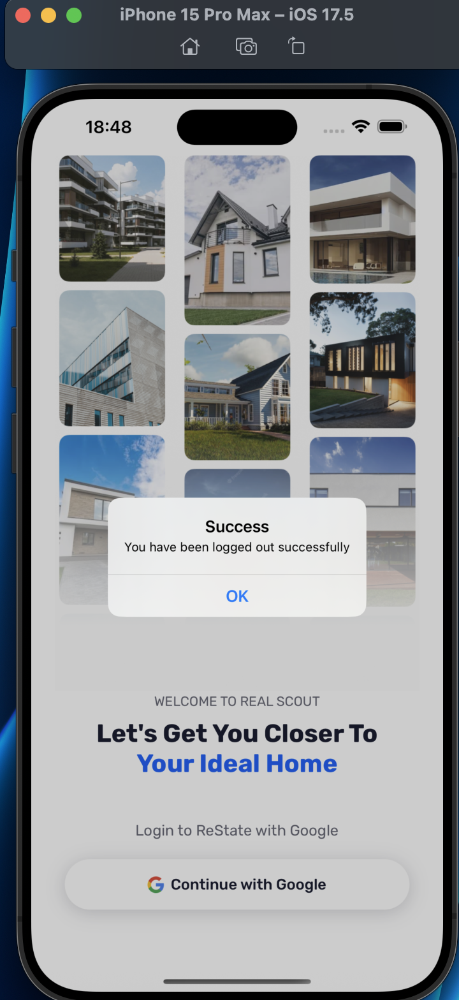
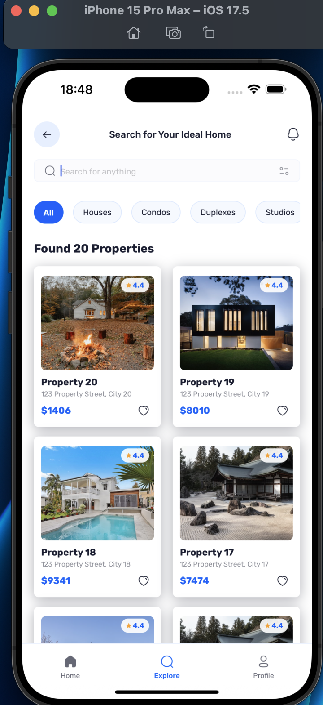
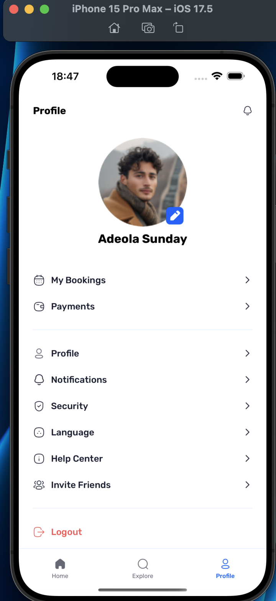
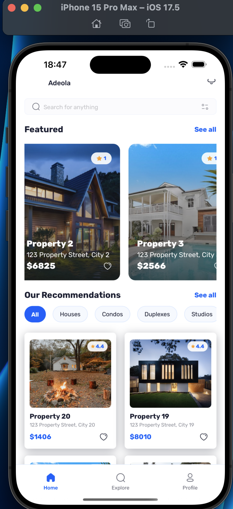
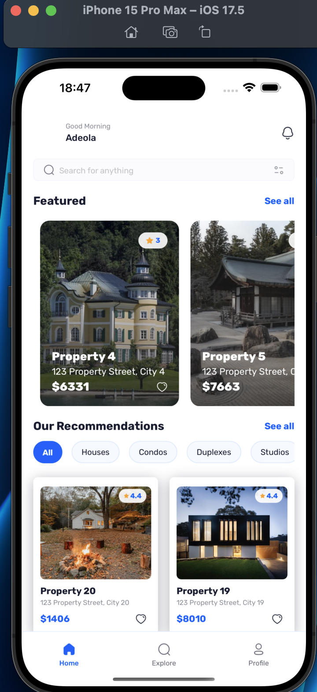

# Real Estate App

## 🎥 Preview


A modern, user friendly real estate mobile application built with **Expo React Native**, **Appwrite**, and **Google Authentication**. This app is designed with modern tools like Expo SDK 52, Appwrite, Tailwind CSS, and TypeScript for a seamless and scalable experience.

## 🚀 Features
- **Secure Google Authentication**: Seamless and secure user sign-ins powered by Google’s OAuth service.
- **Dynamic Home Page**: Showcases the latest and recommended properties with advanced search and filtering capabilities.
- **Intuitive Explore Page**: Browse a wide range of properties with a clean, user-friendly interface.
- **Detailed Property Pages**: Comprehensive property details, including high-quality images and key information.
- **Customizable Profile Page**: Effortlessly manage user settings and personalize profiles.
- **Efficient Data Fetching**: Custom-built solution inspired by TanStack Query for fast, optimized API calls.
- **Scalable Architecture**: Modular, reusable code design ensures easy maintenance and feature expansion.

## 📸 Screenshots
















## 🛠️ Tech Stack
- **Frontend**: Expo, React Native, React Navigation (dynamic routing), NativeWind (Tailwind CSS)
- **Backend**: Appwrite for robust data storage and management
- **Authentication**: Google OAuth for secure logins
- **Data Management**: Custom data-fetching solution inspired by TanStack Query
- **Tools**: Git, GitHub, npm

## 📦 Getting Started
1. **Clone the Repository**:
   ```bash
   git clone https://github.com/AdeolaOkubadejo/real-estate-app.git
